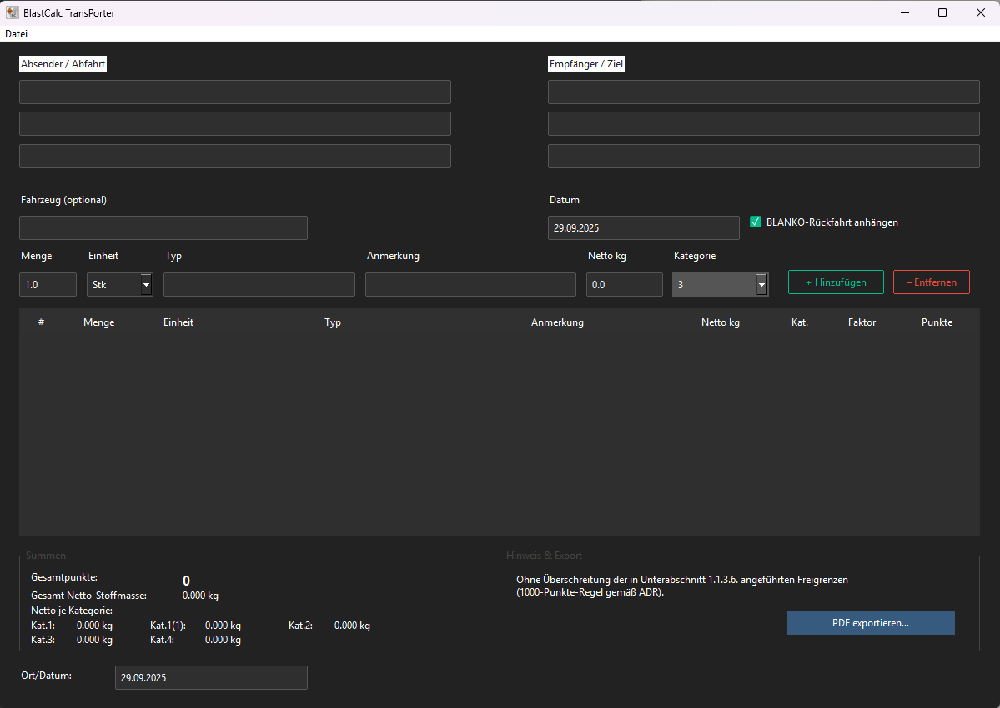

# BlastCalc Transporter

**Status:** 🚧 **Beta (Work in Progress)**  
Desktop-Tool zur schnellen Erstellung von **Transportscheinen unter der ADR-1000-Punkte-Regel** (1.1.3.6).  
GUI in **Tkinter + ttkbootstrap (Dark Theme)**, PDF-Export inklusive **BLANKO-Rückfahrtseite**.

 <!-- ersetze durch deinen Pfad/Datei -->

---

## Features

- **1000-Punkte-Rechner** mit Beförderungskategorien  
  - Kat. **1 × 50**, **1\*** × **20**, **2 × 3**, **3 × 1**, **4/5 × 0**
- **Dark UI**, frei skalierbar (absolute/relative Koordinaten via `.place`)
- **Postenliste**: Index, Menge, Typ, Netto kg, Kat., Faktor, Punkte (Auto-Berechnung)
- **Summen**: Gesamtpunkte, Gesamt-Netto, Netto je Kategorie
- **PDF-Export (A4)**:
  - Tabelle mit **Gitterlinien** und **erhöhtem Zeilenabstand** zum Handschreiben
  - Hinweiszeile zur **1000-Punkte-Regel**
  - **BLANKO-Rückfahrtseite** (Mengen/Punkte leer, **Absender/Empfänger getauscht**)
- **Speichern/Laden** als `.adrjson`
- Eigenes **App-Icon** (BC + 1000-Raute)

> ⚠️ **Hinweis/Disclaimer:** Dieses Tool unterstützt die Dokumentation bei Anwendung der **ADR-Erleichterung 1.1.3.6 (1000-Punkte)**.  
> Es **ersetzt keine vollständigen Beförderungspapiere gemäß ADR 5.4** und keine betriebliche Gefahrgut-Unterweisung.  
> Ergebnisse sind **fachlich zu prüfen** und verbleiben in der Verantwortung des Anwenders.

---

## Bedienung (Kurz)

1. **Absender** / **Empfänger** eintragen (optional: **Fahrzeug**, **Datum**).  
2. Posten erfassen: **Menge**, **Typ**, **Netto kg**, **Kategorie** → **„+ Hinzufügen“**.  
3. Unten prüfen: **Gesamtpunkte**, **Gesamt-Netto**, **Netto je Kategorie**.  
4. **PDF exportieren …**  
   - Option **„BLANKO-Rückfahrt anhängen“** erzeugt eine zweite Seite (Mengen/Punkte leer, **Adressen getauscht**).  
5. Projekt als **`.adrjson`** speichern, um später weiterzuarbeiten.

---

## Haftungsausschluss

Dieses Programm wird **ohne Gewähr** („as is“) bereitgestellt.  
Der Autor/Die Autoren übernehmen **keine Haftung** für Schäden, die direkt oder indirekt aus der Nutzung entstehen.  
Die **konforme Anwendung der ADR-Vorschriften** liegt in der Verantwortung des Nutzers/Unternehmens.  
Vor jedem Einsatz sind **Plausibilität und Vollständigkeit** der erzeugten Dokumente zu prüfen.

---
